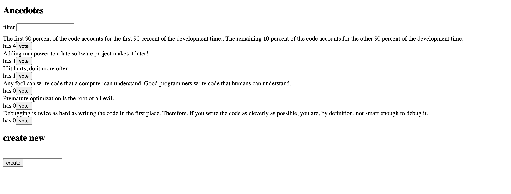
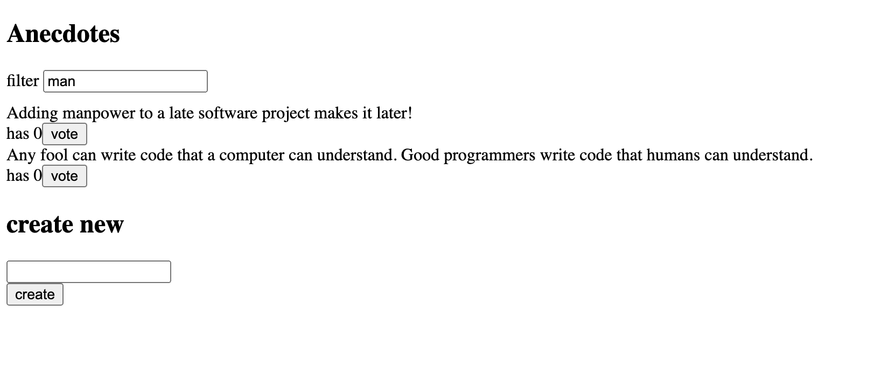
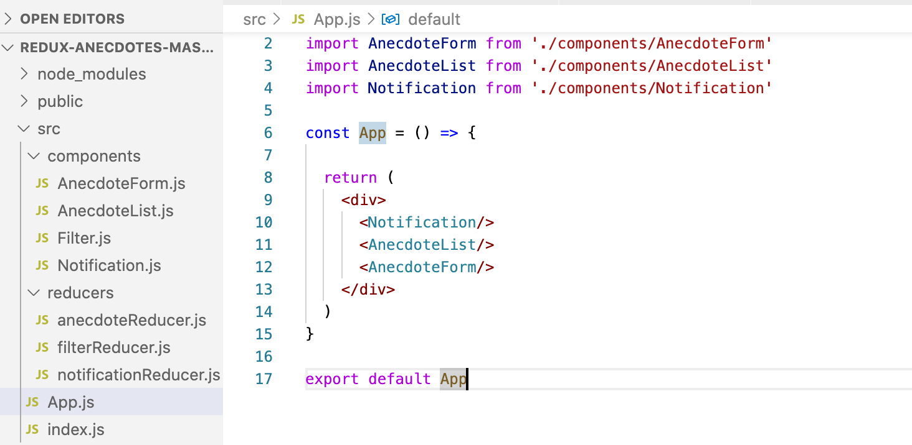

# redux-thunk-anecdote
This is a simple application to display and add new anecdotes.
A notification will be shown when an anecdote is upvoted, and removed after 5 seconds
In addition it will sort the anecdotes by votes and a filter option is also provided.

the votes and anecdotes will be stored at a backend server, redux-thunk is used as a middleware to maintain async behaviour in reducers

Filter component

Code Structure:

